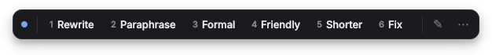
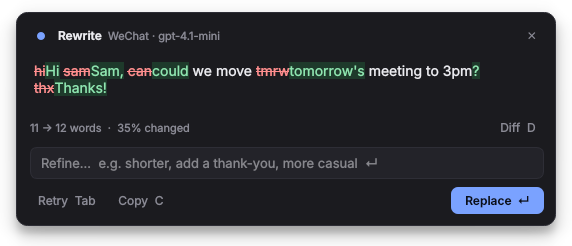
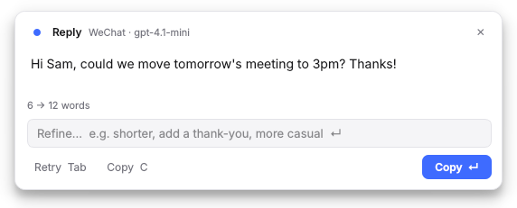
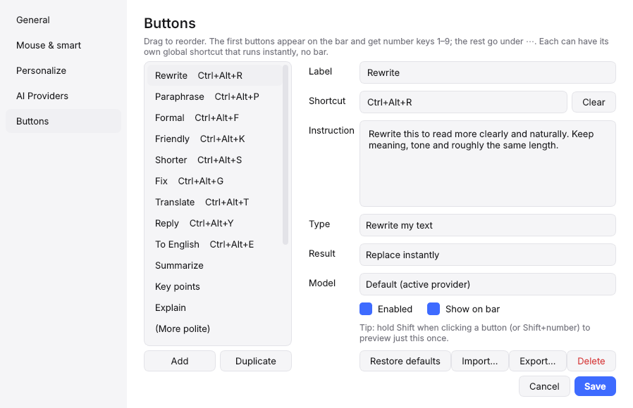

# Quillbar

**Select text in any Windows app. Pick a tone. It's rewritten in place.**

**[Website & live demo](https://syed1337.github.io/QuillBar/)** · [Download](https://github.com/Syed1337/QuillBar/releases/latest)

A single-line AI toolbar for the apps you actually write in: WeChat, WhatsApp, Telegram, Outlook, Gmail, Slack, Word, any browser. Bring your own API key for any OpenAI-compatible provider.



[](https://github.com/Syed1337/QuillBar/actions/workflows/tests.yml)


[](LICENSE)

---

## Why another one?

[WritingTools](https://github.com/theJayTea/WritingTools) opens a large window full of buttons. Quillbar keeps it to **one thin bar** next to your cursor, and puts the result **back in the exact window you came from**, so it works for quick chat replies and emails without breaking your flow.

## Features

**Rewrite in place**
- Rewrite, Paraphrase, Formal, Friendly, Shorter, Fix, Translate, Reply, Summarize, Key points, Explain, plus 8 more you can switch on
- Your own buttons with your own prompts, shortcuts and model
- Two-way Translate: English ⇄ Chinese (or any pair) in one button, direction picked automatically

**Three ways to trigger**
- `Ctrl+Alt+Space` shows the bar for the selected text
- A shortcut per button (e.g. `Ctrl+Alt+F` = Formal) replaces instantly, no bar
- **Mouse mode**: the bar pops up after you select text with the mouse, like PopClip
- Optional: double-tap `Ctrl` or `Shift`

**Preview before you commit**



- Streams the result, shows a word-level diff, word count and % changed
- `Enter` replace · `Tab` retry · `C` copy · `D` toggle diff · `Esc` close
- Type in **Refine…** ("shorter", "add a thank-you") to adjust the result
- Hold `Shift` when clicking a button (or `Shift+1…9`) to preview just once

**Smart Reply**



Select a message you received, press **Reply**, and paste the draft into the reply box.

**Knows where you are**
- **App rules**: WeChat stays casual and short, Outlook keeps greeting and sign-off. Add your own per app.
- **About me & my style**: one note added to every request ("British spelling, sign emails as Sam").
- **Smart select**: nothing selected in a chat app? It uses the whole message box.
- Placeholders in any prompt: `{app}` `{date}` `{time}` `{lang1}` `{lang2}`

**Private by default**
- API keys encrypted with your Windows account (DPAPI)
- Optional masking of emails, phone and card numbers before anything leaves your PC
- History is memory-only and gone when you quit
- Clipboard restored after every replace
- Mouse mode copies nothing until you click a button

**Any provider**

| Provider | Base URL |
|---|---|
| OpenAI | `https://api.openai.com/v1` |
| DeepSeek | `https://api.deepseek.com/v1` |
| Qwen (DashScope) | `https://dashscope.aliyuncs.com/compatible-mode/v1` |
| Kimi (Moonshot) | `https://api.moonshot.cn/v1` |
| Google Gemini | `https://generativelanguage.googleapis.com/v1beta/openai` |
| Anthropic Claude | `https://api.anthropic.com/v1` |
| DMXAPI | `https://www.dmxapi.com/v1` |
| OpenRouter | `https://openrouter.ai/api/v1` |
| Groq | `https://api.groq.com/openai/v1` |
| Ollama (local) | `http://localhost:11434/v1` |
| LM Studio (local) | `http://localhost:1234/v1` |

All are presets in Settings. Press **Fetch models** to pick a model your key can use. Different buttons can use different models.

## Install

### Option 1: one click (needs Python)

1. Install [Python 3.10+](https://www.python.org/downloads/) and tick **Add python.exe to PATH**.
2. Download `quillbar.py` and `Start-Quillbar.bat` into the same folder.
3. Double-click **Start-Quillbar.bat**. The first run installs the two dependencies.

### Option 2: standalone exe (no Python)

Download `Quillbar.exe` from [Releases](https://github.com/Syed1337/QuillBar/releases) and run it.
It isn't code-signed, so Windows SmartScreen may warn on first launch: **More info → Run anyway**.

### Option 3: from the command line

```bat
pip install -r requirements.txt
pythonw quillbar.py
```

On first launch Settings opens on **AI Providers**: pick a preset, paste your key, press **Test**.
Quillbar lives in the system tray. **Start with Windows** is on by default (tray menu to change).

## Shortcuts

| Key | Action |
|---|---|
| `Ctrl+Alt+Space` | Show the bar |
| `1`–`9` | Run a bar button (while the bar is open) |
| `Shift+1`–`9` | Preview that button first |
| `Ctrl+Alt+R / P / F / K / S / G` | Rewrite / Paraphrase / Formal / Friendly / Shorter / Fix |
| `Ctrl+Alt+T / Y / E` | Translate / Reply / To English |
| `Esc` | Close or cancel |

Everything is configurable in **Settings → Buttons**. `Ctrl+Z` in your app undoes a replacement.

## Settings



| Page | What's there |
|---|---|
| General | Bar shortcut, theme (auto / dark / light), buttons on bar, start with Windows, system prompt |
| Mouse & smart | Mouse mode, text-cursor-only, excluded apps, double-tap, smart select, masking, history |
| Personalize | About me & style, translate language pair, per-app rules |
| AI Providers | Add providers, keys, models, test connection |
| Buttons | Label, shortcut, instruction, type, result (replace / preview / copy), model, import / export |

Config lives in `%APPDATA%\Quillbar\config.json`.

## How it works

1. Shortcuts use Win32 `RegisterHotKey`: no keyboard hook, no admin rights, near 0% CPU.
2. On trigger it records the foreground window, sends `Ctrl+C`, and only trusts the clipboard if it actually changed.
3. The bar is a `WS_EX_NOACTIVATE` window, so clicking it never steals focus or drops your selection.
4. The result is pasted back into the same window, re-focusing it if you switched away. If that window is gone, the result stays on your clipboard.
5. Your previous clipboard contents are restored afterwards.

## Known limits

- **Apps run as administrator** won't accept input from a normal app (Windows rule). Run Quillbar as admin too if you need them.
- **Rich text** (bold, links in Word or Outlook) comes back as plain text.
- **Mouse mode** relies on the text cursor (I-beam). Apps with custom cursors may not trigger it; turn off *text cursor only* in Settings if so.
- Avoid `Ctrl+Space` as the main shortcut: it switches Chinese/Japanese input methods.
- Windows only. macOS users: see [WritingTools](https://github.com/theJayTea/WritingTools)' native port.

## Build the exe yourself

```bat
pip install -r requirements.txt pyinstaller
pyinstaller --onefile --windowed --name Quillbar quillbar.py
```

Output: `dist\Quillbar.exe`. Pushing a tag like `v1.1` builds it automatically and attaches it to a GitHub Release.

## Development

```bat
pip install -r requirements.txt pytest
set QT_QPA_PLATFORM=offscreen
pytest tests
```

The whole app is one file, `quillbar.py`, split into clearly marked sections (win32, hotkeys, config, llm, prompts, toolbar, preview, settings, app). Issues and pull requests are welcome.

## Credits

Inspired by [WritingTools](https://github.com/theJayTea/WritingTools) by Jesai (theJayTea) and contributors. Quillbar is an independent implementation and shares no code with it.

## License

[MIT](LICENSE) © 2026 Syed
